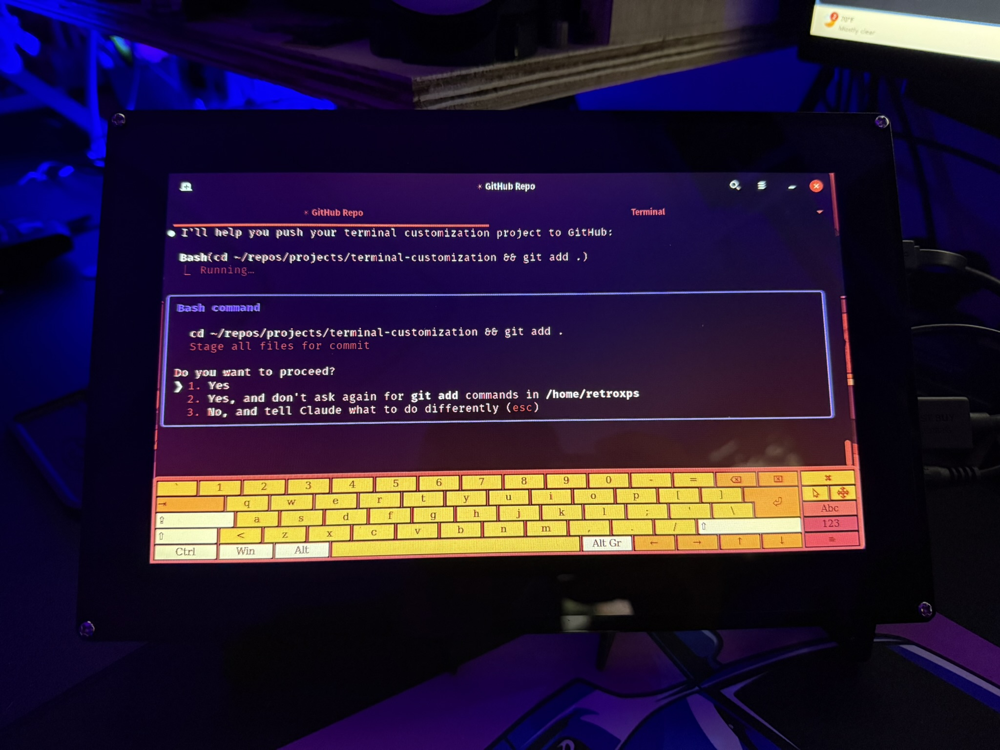

# Terminal Customization Suite

A collection of scripts to customize terminal appearance and monitor color effects.



## Contents

### 1. theme-switcher.sh
Terminal color themes including:
- 🦇 Bat Computer (Matrix Green)
- 🌆 Cyberpunk (Red/Orange/Blue)
- 🌃 NeonPulse (Retro Pink/Blue)
- 🌊 Ocean (Cyan/Magenta)
- 🔥 Fire (Red/Yellow)
- 🌸 Sakura (Pink/Purple)
- ⚡ Electric (Yellow/Blue)
- 🌌 Space (Purple/Green)

### 2. monitor-effects.sh
Monitor color filters:
- 🟠 Amber/Orange CRT
- 🟢 Green Phosphor Terminal
- 🔵 Blue Night Mode
- 🔴 Red Dark Room
- 🟣 Cyberpunk Purple
- 🌅 Warm Sunset
- ❄️ Cool Blue
- 🩸 Deep Blood Red
- 🔄 Reset to Normal

## Usage

```bash
# Change terminal theme
~/repos/projects/terminal-customization/theme-switcher.sh

# Apply monitor effects
~/repos/projects/terminal-customization/monitor-effects.sh
```

## Quick Access
Add these aliases to ~/.bashrc:
```bash
alias themes='~/repos/projects/terminal-customization/theme-switcher.sh'
alias monitor='~/repos/projects/terminal-customization/monitor-effects.sh'
```

## Notes
- Terminal themes work in regular terminal emulators (GNOME Terminal, etc)
- Monitor effects use xrandr to adjust display gamma
- Touchscreen calibration: `xinput map-to-output 8 DVI-I-1`