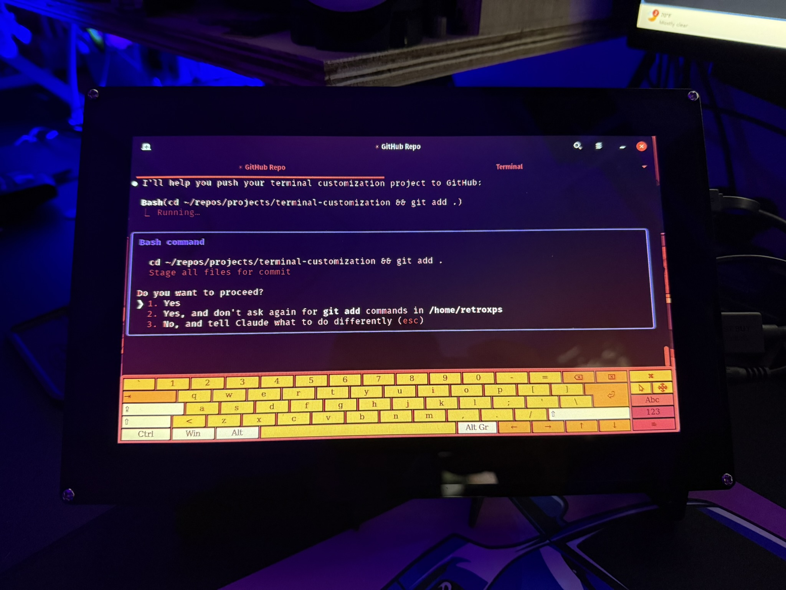

# Terminal Customization Suite

A comprehensive collection of scripts to customize terminal appearance, add fun effects, and enhance your command line experience.



## 🎨 Features

### Visual Customization
- **`themes`** - 8 terminal color themes (Cyberpunk, Matrix, NeonPulse, etc.)
- **`monitor`** - 9 monitor color effects (CRT, Blood Red, Cyberpunk Purple)
- **`transparency`** - Terminal background transparency control
- **`fonts`** - Terminal font switcher
- **`cursor`** - Cursor style customization

### Fun Effects
- **`effects`** - Matrix rain, typing effects, glitch text, neon clock
- **`ascii`** - Animated ASCII art (spinning globe, fire, dancing figures)
- **`sounds`** - Terminal sound effects and beeps

### Productivity Tools
- **`stats`** - Live system stats dashboard (CPU, RAM, disk, network)
- **`weather`** - Weather in terminal and prompt integration
- **`gitprompt`** - Git-aware prompt with branch and status info
- **`games`** - Terminal games (Snake, Tetris, Moon Buggy)

## 🚀 Quick Start

### Main Launcher
```bash
terminal-suite  # Full interactive menu
ts              # Short alias for quick access
```

### Direct Commands
All features are also available through simple command aliases:

```bash
# Visual themes
themes      # Change terminal colors
monitor     # Apply monitor effects
fonts       # Switch terminal fonts
cursor      # Change cursor style
transparency # Control terminal opacity

# Fun stuff
effects     # Fun visual effects
ascii       # Animated ASCII art
games       # Play terminal games
sounds      # Sound effects

# Productivity
stats       # System monitoring
weather     # Weather info
gitprompt   # Git-aware prompt
```

## 📦 Installation

1. Clone this repository
2. Run `source ~/.bashrc` or open a new terminal
3. All commands are ready to use!

## 🎮 Feature Highlights

### Terminal Themes
- 🦇 Bat Computer (Matrix Green)
- 🌆 Cyberpunk (Red/Orange/Blue)
- 🌃 NeonPulse (Retro Pink/Blue)
- 🔥 Fire (Red/Yellow)
- ⚡ Electric (Yellow/Blue)
- And more!

### Monitor Effects
- 🩸 Deep Blood Red
- 🟢 Green Phosphor CRT
- 🟣 Cyberpunk Purple
- 🌅 Warm Sunset
- ❄️ Cool Blue

### Games Included
- 🐍 Snake (with built-in version)
- 🧱 Tetris
- 🚙 Moon Buggy
- 🎲 Number Guessing

## 📝 Notes
- Works with GNOME Terminal and most terminal emulators
- Monitor effects use xrandr (may not work in all environments)
- Some features require internet (weather)
- Games can be installed on first run